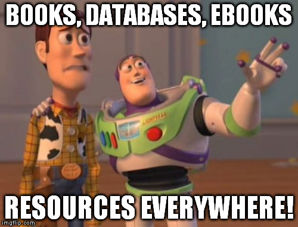

# Installation and course information

## Course Goals

There are a few primary goals for this course that are worth outlining off the bat since not all beginner courses are the same in python.


I have 3 primary goals for you by the end of the course:

1. Get you up and running quickly with developing python code/apps
2. Write **Maintainable and Readable** code in python
3. Introduce you to programming concepts if this is your first language


## Course layout

Each numbered folder (1-6) represents a module/section of this course has 3 files in it:

### readme.md

Information about the topic, the primary resource for reference to complete the exercises and challenge(s). 

### exercises.py

A set of smaller exercises that are intended to gear you up for ```challenge.py```. The exercises are intended to be completed after reading ```readme.md```

### challenge.py

A challenge on the topic of the folder, intended to be completed last.


The intention is to complete the sections in order (1 then 2 then 3 etc.) and the files in the order as they are laid out above (readme.md then exercises.py then challenge.py). 


Also where applicable I have put some extra resources for topics in case my explanations suck.



[source]( https://imgflip.com/i/19fiqp )


## Getting setup

This course will require you to have a few things to get started:

1. Python (this course is designed for python 3 and up. See [*Python installation and setup* section](#python-installation-and-setup) for installation details)
2. A code editor or IDE (integrated development environment); see [*Code editor/IDE setup* section](#code-editor-ide-installation-and-setup) for more details
3. [git (optional)](https://git-scm.com/); git is a version control system that can be helpful when coding, it is completely optional since you can download a [zipped version of this repository straight from github](https://github.com/Descent098/python-exercises/archive/master.zip).

Just a note, I am not a teacher so feel free to [submit feedback](mailto:kieran.wood1@ucalgary.ca) to me to help improve this course for future generations.


[source]( https://pics.me.me/when-you-have-to-teach-yourself-a-subject-because-your-16262454.png )

## Python installation and setup

First things first, lets get python installed on your computer. Below are details for how to do this on each operating system, so follow the steps for your own.

### Windows

1. [Download python](https://www.python.org/ftp/python/3.7.4/python-3.7.4-amd64.exe)(This is version 3.7.4 which is the latest as of 4th of september 2019)
2. Run the .exe file **MAKE SURE** you check the box on the first screen of the installer that says "add python to PATH", if you forget this you wont be able to run anything
3. Verify that everything installed properly by opening up cmd (hit the windows key and type cmd and then hit enter) and running ```python```; You should get something like this:

``` cmd
Python 3.7.3 (v3.7.3:ef4ec6ed12, Mar 25 2019, 21:26:53) [MSC v.1916 32 bit (Intel)] on win32
Type "help", "copyright", "credits" or "license" for more information.
>>>
```

### Mac OS

1. Buy a windows or linux machine.

### Linux

#### Debian based distributions (ubuntu, linux mint etc.)

1. Open your terminal, and run ```sudo apt get update && sudo apt install python3 -y && sudo apt install python3-pip -y```; This will find the list of most up to date versions of python and install python 3 and a useful addon to python called pip.
2. Verify everything installed by opening your terminal and running ```python3``` something like this should appear:

``` bash
Python 3.7.3 (v3.7.3:ef4ec6ed12, Mar 25 2019, 21:26:53) [GCC 4.6.3] on linux2
Type "help", "copyright", "credits" or "license" for more information.
>>>
```

## Code editor/IDE setup

There are a few options for editors here are the most popular for python:
- [Visual Studio code](https://code.visualstudio.com/) (My personal favourite): Just install the [Python Extension Pack](https://marketplace.visualstudio.com/items?itemName=donjayamanne.python-extension-pack)
- [Atom](https://atom.io/): Install [ide-python](https://atom.io/packages/ide-python)
- [Sublime text](https://www.sublimetext.com/3)(Free/paid): I have honestly never used it, but here's a guide I found https://www.youtube.com/watch?v=xFciV6Ew5r4
- [Pycharm](https://www.jetbrains.com/pycharm/) (paid)


## Python Files and REPL

There are two different modes to run python:

### Files

Python files use the .py extension on the file. Python files are read top down and execute **line-by-line**, unlike *compiled languages*, python (since it is *interpreted*) does not check **logical errors** before running your code. This means any bugs that are written will only be caught by getting to that point in the running file.


### REPL (Read Evaluate Print Loop)

Python has an advantage over other languages in that you can run python code without having it in a file. You can use a REPL environment to run pieces of python code  on the fly, with immediate feedback and without having to create & run a file.


To do this on windows you can open a terminal (hit the windows key and type cmd), and then just type ```python``` you will then get a prompt that looks something like this:

```cmd
Python 3.7.3 (v3.7.3:ef4ec6ed12, Mar 25 2019, 21:26:53) [MSC v.1916 32 bit (Intel)] on win32
Type "help", "copyright", "credits" or "license" for more information.
>>>
```

On mac and linux you can run ```python3``` and should get a prompt like this:

```bash
Python 3.7.3 (v3.7.3:ef4ec6ed12, Mar 25 2019, 21:26:53) [GCC 4.6.3] on linux2
Type "help", "copyright", "credits" or "license" for more information.
>>>
```


From here you can start typing python code in, and it will run line by line as you type it.


## Python basic syntax

Now you have an environment setup lets look at some python shall we.


### Comments

In python you can add comments (text that doesn't do anything); This is incredibly useful for leaving yourself and others notes about how code works, what code does, or to 'comment out' code that you just don't want to run. Throughout the course most of the python files will contain comments that will help you to understand what is happening in the code. Also I will leave sections of challenges and exercises 'commented out' to allow you to work on them in order.

>  "Commenting your code is like cleaning your bathroom - you never want to do it, but it really does create a more pleasant experience for you and your guests"    - Ryan Campbell

There are two ways of doing comments:

1. Single line comments; comments that only span a single line are denoted with a # in front of them:

   ```python
    # This is a single line comment
   ```

2. Multiline comments; comments that span multiple lines are denoted with three sets of double quotes:

    ```python
    """
    This
    comment
    spans
    many
    lines
    """
    ```

As you are going through it is always a good idea to put comments in your code so that other people (and you in 3 months) will know what's happening. Believe me this **will** make a difference

---

> True programmers don;t comment their code... If it was hard to write then it should be hard to read 
> -Anonymous

---

> When I wrote this code only God and I understood what it does... Now, only God knows.
> -people who don't comment their code

---

### Functions

Functions in python are commands you can use to do specific actions. Functions can also be given data (called arguments), and return data.

The basic syntax looks like this

```python
function-name(arguments)
```

You can tell that something is a function if it has parenthesis "()" after the function name.

---

For example the print() function in python takes some text (a string [i'll explain what that is in the next chapter] as an argument) and prints it to the terminal.

```python
print("Hello World!")
```

### Running python code

To run your code (after you've written it) use: ```python (filename).py``` or ```python3 (filename).py``` (linux)

## Exercise time

Check out the ```exercises.py``` for some simple exercises to try out.
