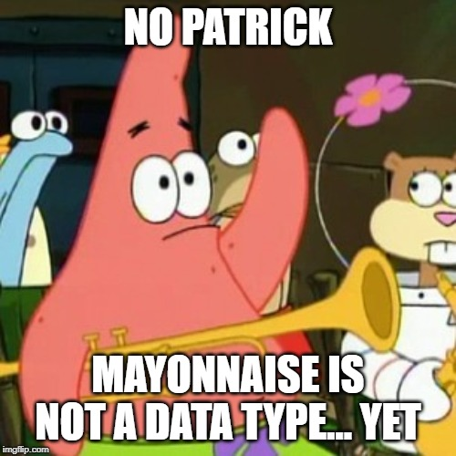

# Variables and Data Types

When you are writing code you will often need to take data and use it/manipulate it in different ways to give a meaningful output. Variables and Data Types are key to understanding python (and any programming language).


## Variables

If you remember from algebra (if you haven't learned it yet feel free to skip this sentence) variables are just some characters that were used to represent numbers. For example ```x = 5``` and then you could use it to say ```5 + x = 10```.


Variables in python work much the same way, except you can store (sometimes called alias) data of different types (text, numbers, decimals etc.). 


### Creating and updating variables

The basic syntax for creating variables looks like this:

```python
variable_name = (some data)
```

You put the *variable name* **on the left** (what you type in when you want to get the data), and the *data* to store/alias **on the right** with a **single** '=' in between.


So for example if you wanted to create a name variable and store someone's name to print out later you could do this:

```python
name = "Kieran" # Created a variable called name

print(name) # Prints: Kieran
```


You can also go in and update a value later on by assigning it some new data:

```python
name = "Kieran" # Create/instantiate name variable

print(name) # Prints: Kieran

name = "Bob" # Reassign name variable to 'Bob'

print(name) # Prints: Bob
```


### Variable names

Naming variables can be hard sometimes, here are the general rules on what you can and cannot do with them.


<u>Can include:</u>

- All upper and lowercase letters
- Underscores
- Numbers (But not as the first character): 1 2 3 4 5 6 7 8 9 0 


<u>Cannot include:</u>

- Dots (Possible but means something different in python): .
- Reserved Characters (Characters that already do something in python): + | & * $ # @ ( ) ? < > = ' " \ / ^ ! ~ _
- The first character as a number


**MAKE VARIABLE NAMES USEFUL**

Constantly reading x, j, i, k and other single letter variables, they all start to meld together. You can easily be confused because they give you no indication of what the variable actually represents (usually). 


#### Variable name guidelines

Here are some guidelines to help create better variable names:

- Use the 4 W's (Who, What, When, Where)

    - Who: If your variable represents someone or something then use their name  i.e.

        ```python
        p = "Lincoln" # Bad, what does p even mean in this context?
        
        president = "Lincoln" # Now you know what I am talking about without seeing the code
        ```

    - What: what the variable is in this context.

        ```python
        dx = 5 # If you know the notation this might make sense but what if someone doesn't
        
        delta_x = 5 # You know exactly what the variable represents
        ```

    - When: this may be less apparent right now but when we look at loops later this naming convention can be useful.

        ```python
        d = "17-10-2019" # We can infer it's a date, but what date is it?
        
        current_date = "17-10-2019" # Now we know it represents the current date
        ```

    - Where: Only useful in specific use cases but still better than nothing.

        ```python
        l = (51.0447, 114.0719) # ¯\_(ツ)_/¯ Who knows what this variable represents
        
        user_coordinates = (51.0447, 114.0719) # Ahh it's user coordinates
        ```


This can sometimes be difficult but if you do it then others looking at your code will hate you much less when your code breaks.


[source](https://thecodinglove.com/when-im-searching-for-a-meaningful-variable-name)


## Data Types

Python can store many different *data types*, we have already seen a few in our examples. As you saw we can store basic (primitive) *data types* such as text (string(s) or str), whole numbers (integers or ints), and decimals (float(s)), and groups or *collections* of data types. Later on (right near the end of the course) we will show you how to create your own data types.




If you are ever unsure you can actually see the 'type' of a variable by using the type() function. For example:

```python
variable_1 = 5 # An integer or int

variable_2 = "hello" # A string or str

print(type(variable_1)) # Prints <class 'int'>

print(type(variable_2)) # Prints <class 'str'>
```


### Primitive Data types

- Integer (or int)

    - Any positive or negative **whole number**:

        ```python
        number_1 = 1 # Positive int
        
        number_2 = -2 # Negative int
        
        number_3 = 1236655686547564756474657457 # Large positive int
        
        number_4 = -432587965423943857612347861 # Large negative int
        ```

        

- Float

    - Any positive or negative **decimal number**

        ```python
        number_1 = 1.5 # Positive float
        
        number_2 = -2.345 # Negative float
        
        number_3 = 12366556.7893 # Large positive float
        
        number_4 = -432587965423.3457 # Large negative float
        ```

        

- String

    - Text; Note that this can include numbers 

        ```python
        variable_1 = "This is a string" # Anything inside the "" is part of the string
        
        variable_2 = 'This is a string' # You can also use '' to create strings
        ```

        

- Boolean

    - Used to indicate **True or False**; Note that True and False also correspond to 1 and 0 respectively

        ```python
        # Booleans are created by just writing true or false NOTE: Capitalize the first letters
        variable_1 = True # True or 1
        
        Variable_2 = False # False or 0
        ```

        


### Collections

Collections are data types that allow you to store multiple variables inside of them. This is convenient in many cases to store data that is logically grouped together like a shopping list, or names of people in a group/class.


I will mention 3 of the most common collections but there are actually many **many** more available in python to cover a wide variety of use cases.

- Lists
    - Allow you to **store** and **change** values that are added to it.
- Tuples
- Dictionaries


### Type Casting


In python you can convert data between data types.


## Exercise time

Check out the ```exercises.py``` for some simple exercises to try out.