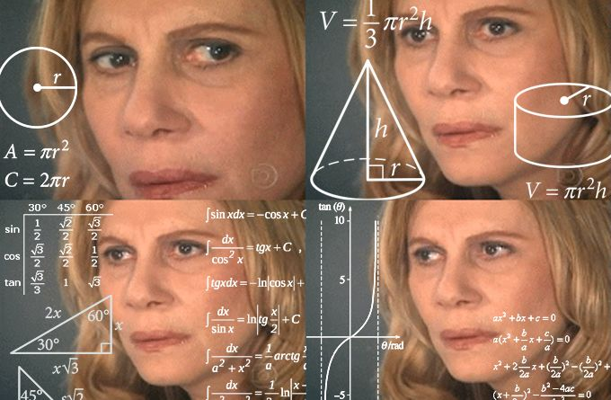

# Operators and Conditionals


## Operators

Operators are symbols built into python that allow for special functionality such as addition, subtraction and


#### Arithmetic operators

Arithmetic operators are operators used to do basic arithmetic (hence the name). What this means is that they are the basis for any calculations you need to make in a program. Most of these will be pretty obvious so I will try and make it more interesting by telling you some of the usefulness (weirdness) you wouldn't expect out of them, as well as some use cases.




##### Addition

This should be pretty basic and boring, in fact you have already seen it before, but for the sake of completeness, here is how to do addition in python:

```python
print(5 + 3) # Prints: 8

# You can also use variables

sum_value = 5 + 8

print(sum_value) # Prints 8

# You can also use variables in place of numbers

sum_2 = 6 + sum_value 

print(sum_2) # Prints: 14 
```

Well that was boring, **but**... there are more interesting things you can do with addition. For example, if you have multiple lists you can actually add them together to combine the two (order matters):

```python
my_list = [1,2,3,4] # Initialize my_list

my_list_2 = [5,6,7,8] # Initialize my_list_2

my_list = my_list + my_list_2 # Take the current value of my_list and add my_list_2 to it

print(my_list) # Prints: [1, 2, 3, 4, 5, 6, 7, 8]

```

As you can see in the above example, when the my_list_2 variable is added to the first my_list variable it is tacked on to the end of it (called *concatenation* in computer science).


Here is where things get weird, if you recall in the first challenge (yes you should do those), I mentioned that strings are **like** lists. This means operands also work on strings:

```python
name = "Hello " # Set name variable to an string 'hello '

name = name + "World!" # Take the current name value and add 'world' to it

print(name) # Prints: Hello World!
```

Just a heads up combining these properties together gives some interesting effects that I won't go into detail with, but I will show you. For example if you add a string and a list: 

```python
my_list = [] # Initialize an empty list

name = "John" # Initialize name variable to John

my_list = my_list + name # Adding the current my_list variable to the string name

print(my_list) # Prints: ['j','o','h','n']
```

Now this ^^ is weird, the reason is that strings are actually lists of **individual characters**, and so as we saw before they are *concatenated* together.


##### Subtraction

Just like addition, subtraction is somewhat boring the syntax for it is pretty simple:

```python
print(5 - 3) # Prints: 2

# You can also use variables

value = 5 - 8

print(value) # Prints -3

# You can also use variables in place of numbers

value_2 = value - 6 

print(value_2) # Prints: -9
```


Unlike addition there are no fun tricks with it though, subtracting from a string or list will just give you an error. 


##### Multiplication

Now multiplication is back to getting weird. First lets get the simple syntax down: 

```python
print(5 * 3) # Prints: 15

# You can also use variables

value = 5 * 8 

print(value) # Prints 40

# You can also use variables in place of numbers

value_2 = value * 6

print(sum_2) # Prints: 120
```


Now for the weird part, with lists and strings you can multiply them, and the results are very fun...

```python
my_list = [1,2,3,4] # Initialize my_list

my_list = my_list * 3 # Take my_list and multiply it by 3

print(my_list) # Prints: [1,2,3,4,1,2,3,4,1,2,3,4]
```

As you can see, when you multiply a list (or string) by a number, it *concatenates* the value of the list (or string) the number of times you multiply it by. So in this case since the list is multiplied by 3, the value of the list is present 3 times in a row.


##### Division

And going back to the boring we have division, division has no special uses, but it does have 2 forms integer and floating point division.


###### Floating Point Division

This is your typical division, it will **always** return a float. The syntax is as follows:

```python
print(5 / 2) # Prints: 2.5

# You can also use variables

value = 5 / 3

print(value) # Prints 1.6666666666666667

# You can also use variables in place of numbers

value_2 = value / 2 

print(value_2) # Prints: 0.8333333333333334
```


###### Integer Division

This sort of division will **always** return an int. If your value comes out to a float (anything with a decimal) then it *takes the floor* of the division (always rounds down even if above 0.5).


The syntax for integer division is pretty simple:

```python
print(5 // 3) # Prints: 1

# You can also use variables

value = 5 // 8

print(value) # Prints 0 (Remember it ALWAYS rounds down)

# You can also use variables in place of numbers

value_2 = value // 6 

print(value_2) # Prints: 0
```


##### Shortcuts

Many of the operations you are doing are going to involve taking the original value of a variable doing an operation and storing the result back in the variable. For example: 

```python
variable_1 = 5 # Initialize the variable to 5

variable_1 = variable_1 + 5 # Take the current value of the variable and add 5

variable_1 = variable_1 - 5 # Take the current value of the variable and subtract 5

variable_1 = variable_1 / 2 # Take the current value of the variable and floating point divide by 2

variable_1 = variable_1 // 2 # Take the current value of the variable and integer divide by 2
```


For addition, subtraction, multiplication and division there is a shortcut to do the above operations. The general form is ```variable_name <operator>= value```

```python
variable_1 = 5 # Initialize the variable to 5

variable_1 += 5 # Take the current value of the variable and add 5

variable_1 -= 5 # Take the current value of the variable and subtract 5

variable_1 /= 2 # Take the current value of the variable and floating point divide by 2

variable_1 //= 2 # Take the current value of the variable and integer divide by 2
```


##### Modulus

What this actually does is returns the **remainder** to the division of the two terms. This is not commonly used other than to check if something is *evenly divisible* by another number. This is because if a number is divisible by another then the **modulus** will be 0:

```python
print(5 % 3) # Prints: 2

# You can also use variables

value = 10 % 5

print(value) # Prints 0 (Therefore 10 is evenly divisible by 5)

# You can also use variables in place of numbers

value_2 = value % 6 

print(value_2) # Prints: 0 (Because 0/anything is always 0)
```


Note that this is an incredibly slow way to do this check, but it is used often enough that it's worth learning.


#### Logical operators

Logical operators are symbols that are used to make comparisons between values. They all return *Boolean* values when used (True or False), and are useful especially when combined with *if statements* (explained later).  All of these comparisons can be made with int's or float's


##### Greater than

Used to check if a value is larger than another value:

```python
print(5 > 3) # Prints: True; since 5 is greater than 3

result = 5 > 3 # You can store the result in a variable

print(result) # Prints: True

print(3 > 5) # Prints: False; since 3 is NOT greater than 5

print(5 > 5) # Prints: False; since 5 is NOT greater than 5 (they are equal)
```


##### Greater than or equal to

Used to check if a value is larger than **or** equal to another value:

```python
print(5 >= 3) # Prints: True; since 5 is greater than 3

result = 5 >= 3 # You can store the result in a variable

print(result) # Prints: True

print(3 >= 5) # Prints: False; since 3 is NOT greater than 5

print(5 >= 5) # Prints: True; since 5 is equal to 5
```


##### Less than

Used to check if a value is smaller than another value:

```python
print(5 < 3) # Prints: False; since 5 is NOT less than 3

result = 5 < 3 # You can store the result in a variable

print(result) # Prints: False

print(3 < 5) # Prints: True; since 3 is less than 5

print(5 < 5) # Prints: False; since 5 is NOT less than 5 (they are equal)
```


##### Less than or equal to

Used to check if a value is smaller than **or** equal to another value:

```python
print(5 <= 3) # Prints: False; since 5 is NOT less than OR equal to 3

result = 5 <= 3 # You can store the result in a variable

print(result) # Prints: False

print(3 <= 5) # Prints: True; since 3 is less than 5

print(5 <= 5) # Prints: True; since 5 is equal to 5
```


##### Not

...


##### And

...


##### Or

...


##### In

...


#### Bitwise operators

**DISCLAIMER: If you are new to programming feel free to skip on to [conditionals](#conditionals) as this section won't be relevant for you.** 


For anyone who has used lower level languages bitwise operators are available in python (binary AND, OR, XOR, Ones Compliment, Left and Right shifts). I am not going to go into detail, but if you are interested here is the syntax:

[Chart taken from here]( https://www.tutorialspoint.com/python/bitwise_operators_example.htm )

| Operator | Description                                                  | Example                                                      |
| -------- | ------------------------------------------------------------ | ------------------------------------------------------------ |
| &        | Binary AND: Operator copies a bit to the result if it exists in both operands | (a & b) (means 0000 1100)                                    |
| \|       | Binary OR: It copies a bit if it exists in either operand.   | (a \| b) = 61 (means 0011 1101)                              |
| ^        | Binary XOR: It copies the bit if it is set in one operand but not both. | (a ^ b) = 49 (means 0011 0001)                               |
| !        | Binary Ones Complement: It is unary and has the effect of 'flipping' bits. | (~a ) = -61 (means 1100 0011 in 2's complement form due to a signed binary number. |
| <<       | Binary Left Shift: The left operands value is moved left by the number of bits specified by the right operand. | a << 2 = 240 (means 1111 0000)                               |
| \>>      | Binary Right Shift: The left operands value is moved right by the number of bits specified by the right operand. | a \>> 2 = 15 (means 0000 1111)                               |


## Conditionals

### if, else, and elif statements


#### if

...

#### else

....

#### elif

...


### While and break statements

#### While

...

#### break

...