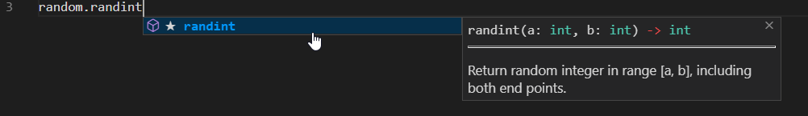
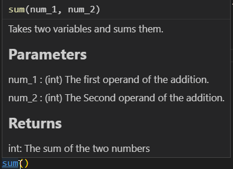

# Functions

We have already used a ton of functions; print(), *list*.append(), input(), int(), etc. This module will focus on learning how to write your own functions. Now there are a ton of use cases for functions, but typically there are 3 reasons to create a function vs just writing the code inline:


1. Reuse; if your code can be generalized and reused in many places in your software, then usually it's better as a function. i.e. if you're creating an e-commerce shop having a function to buy something is better than writing every possible purchase that could be made inline.
    

2. Organization; Even if code is being used once it's sometimes easier to read if you are just calling functions instead of inline code. Let's say for example you are creating a game, if you create functions with good names it's often easy to tell what's happening without having to go through many lines of code:

    ```python
    # Gameloop
    while turns < 100: 			# Game goes until 100 score
        player_move(player_one) # Player one's move
        player_move(player_two) # Player two's move
        turns += 1
    
    if player_one.score > player_two.score:
        print("Player Two Wins!")
    elif player_one.score < player_two.score:
        print("Player Two Wins!")
    ```

    Even without knowing what the functions are **exactly** doing you can get an idea of what's happening here. There's some game that goes on until the *turns variable* is 100 and player's take turn making moves, then after 100 *turns* whoever has higher score wins
    

3. Modules/API's; Sometimes your code won't always be directly seen by people. Python uses a lot of modules (which can also be called, libraries, API's, or packages) to get a lot of functionality. For example earlier in one of the challenges we *imported* the function random.randint() to generate a random number. If the creator of the module wrote the code inline then there would be no way to get that simple functionality out of the module (there will be more detail about this in the next module).


## Basic Syntax

The basic syntax to define a function is using the keyword *def* followed by the function name (what you want to call it), then the arguments (what data the function needs to run),  then the *docstring* (description of the function), then the function body (the code the function needs to run), followed by an optional *return* statement (data the function should give back). Here is what it should look like if you have a function called *sum* that takes two integers, adds them, and returns the result:

```python
def sum(num_1, num_2):
    """
    Takes two variables (int's or floats), and
    adds them together, then returns the result
    """
	result = num_1 + num_2
	return result
```


### Commenting/Docstrings

Remember earlier in the course when I said that commenting is important? Well trust me it's really important for functions. Properly commenting functions can save you (and others who use your code) a ton of time. Specifically functions have special types of comments called *docstrings*, these *docstrings* are ways to tell people how to use your function properly.


Most text editors/IDE's use docstrings to help people write code with functions. For example here is what the *docstring* for the random.randint() function looks like in visual studio code:



As you can see it tells you what arguments you need (a and b), what types they should be (both ints), tells you what you will get back/returned (an int), and gives a short description of what the function does. Now this is sort of a best case scenario, but at least you should include a short description of what the function does, and what it returns even if you don't bother with anything else.


To create *docstrings* you simply need to add a multiline comment as the first line of a function definition. There's a ton of debate in python as to what is the best way to write *docstrings*, personally I prefer the [numpy style]( https://numpydoc.readthedocs.io/en/latest/format.html#sections ) but there are a few other options if you don't ([click here]( https://canadiancoding.ca/posts/details/10/ ) to see a post I made about this). A basic docstring for the sum() example above would look like this:

```python
def sum(num_1, num_2):
    """
    Takes two variables and sums them.

    Parameters
    ----------
    num_1 : (int)
        The first operand of the addition.

    num_2 : (int)
        The Second operand of the addition.

    Returns
    -------
    int: 
        The sum of the two numbers
    """
    result = num_1 + num_2
    return result
```


Which then gives you something like this in visual studio code when you try to call the function:




### Variable Scope

*Variable Scope* just refers to *where* you can access a variable from. In the case of functions you can only access variables that are in the functions from ***inside the function***. For example:


```python
greeting = "Hello You!" # This would be called a global variable because it's not inside a function

def greet():
    """Prints a greeting"""
	greeting = "Good Bye!" # Now a 'function/local' greeting variable exists
	print(greeting) # This will use the 'function/local' variable 
	
greet() # Prints: Good Bye!
print(greeting) # Prints: Hello You!
```


As you can see the variable *greeting* that's outside the function has a lower 'priority' than the one inside the function, and the one inside the function has no effect on the one outside the function. As a rule of thumb you should always aim for 'function/local' variables since only the function has access to them.


### Arguments/Parameters

Arguments (sometimes called parameters), are pieces of information you use to complete whatever your function needs to do. In the example I gave of the sum() function at the beginning of this module, there were two arguments: num_1 and num_2. 


Arguments are *passed* to functions and create a 'function/local' variable of the same name, to be used in any code running inside the function. They can be of any type, but there are a few different ways to setup arguments:


#### Positional Arguments

These are the most common arguments, this is exactly what I used in sum() from earlier. They are arguments that the values are given based on *where* they were inputed. For example let's take a function called difference which **subtracts** two numbers:


```python
def difference(num_1, num_2):
    """
    Takes two variables and subtracts them them.

    Parameters
    ----------
    num_1 : (int)
        The first operand of the subtraction.

    num_2 : (int)
        The Second operand of the subtraction.

    Returns
    -------
    int: 
        The difference of the two numbers
    """
    result = num_1 - num_2
    return result
```


Depending on which order I *pass* my arguments to the function changes which value is assigned to num_1 and num_2:

```python
difference(4, 2) # Returns 2 because num_1 = 4 and num_2 = 2
difference(2, 4) # Returns -2 because num_1 = 2 and num_2 = 4 now
```


#### Keyword Arguments

These are less common but incredibly useful ways of declaring variables that have 2 distinctions compared to positional arguments:

1. They can be in any order
2. They have a default value provided


Let's take the example of the greet() function from earlier and give people the ability to customize the message:

```python
def greet(name="John doe", greeting="Hello there: "):
    """Greets a person with the greeting and their name
    
    Parameters
    ----------
    name: (str)
    	The name to greet by.
    greeting: (str)
    	The greeting to greet by.
    """
	print(name, greeting)
```


Now there are a few ways to call this function, because there are defaults for both variables already set we could just call it as it is:

```python
greet() # Prints: Hello there: John Doe
```


or we can just change 1 of the variables:

```python
greet(name = "Kieran Wood") # Prints: Hello there: Kieran Wood
greet(greeting = "How it be: ") # Prints: How it be: John Doe
```


or both in any order:

```python
greet(name = "Kieran Wood", greeting = "How it be: ") # Prints: How it be: Kieran Wood
greet(greeting = "How it be: ", name = "Kieran Wood") # Prints: How it be: Kieran Wood
```


### Function Body

As we have seen the function body is simply the statements that make up what the function needs to do. A function body for example could be a calculation, running the code necessary to print something to the screen, or even creating and returning information (such as in random.randint()).


### Returns

Return statements are optional, by default if one is not defined the function returns what's called a None (basically nothing, it just let's python know it's done running). You can return any type; an int, float, a collection (such as a string, list, dictionary), a logical or arithmetic operation, or even return a call to another function.


### Type declarations

Optionally you can give what are called *type declarations*, these allow you to specify what *type* arguments and/or *returns* should be. This can be helpful to let people know what the function is expecting to receive and return. It can also help cut down on the amount you need to write for *docstrings*. Let's take the example of the sum() function from earlier:

```python
def sum(num_1: int, num_2: int) -> int:
    """
    Takes two variables and sums them.

    Parameters
    ----------
    num_1 :
        The first operand of the addition.

    num_2 :
        The Second operand of the addition.

    Returns
    -------
	The sum of the two numbers
    """
    result = num_1 + num_2
    return result
```


As you can see all you need to do is add a ```: type``` after an argument, and an ```-> return_type``` after the arguments to specify argument types and return types respectively. One thing to keep in mind is that this **DOES NOT ENFORCE THE TYPES**, it merely gives people an idea of what they **should** do not what they **have to do**. 


